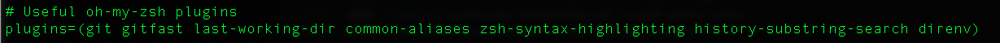

# Personal Setup Instructions

This project is for the personal setup of a new laptop for myself. This assumes an Intel Macbook Pro notebook.
It has been heavily based on the setup guide used by [Le Wagon](https://www.lewagon.com) for their bootcamps.

To setup you will have to do the following in thefollwing order.

1. Install Gitlab CLI
2. Install XCode
3. Install Homebrew and its extensions
4. Install Visual Studio Code and its extensions
5. Install Oh my zsh!
6. Install the dotfiles
7. Install Python, Jupyter and all their packages
8. Install Docker
9. Install DBeaver


## GitHub CLI

First in order to **login**, copy-paste the following command in your terminal:

⚠️ **DO NOT edit the `email`**

```bash
gh auth login -s 'user:email' -w
```

gh will ask you few questions:

`What is your preferred protocol for Git operations?` With the arrows, choose `SSH` and press `Enter`. SSH is a protocol to log in using SSH keys
instead of the well known username/password pair.

`Generate a new SSH key to add to your GitHub account?` Press `Enter` to ask gh to generate the SSH keys for you.

If you already have SSH keys, you will see instead `Upload your SSH public key to your GitHub account?` With the arrows, select your public key
file path and press `Enter`.

`Enter a passphrase for your new SSH key (Optional)`. Type something you want and that you'll remember. It's a password to protect your private
key stored on your hard drive. Then press `Enter`.

`Title for your SSH key`. You can leave it at the proposed "GitHub CLI", press `Enter`.

You will then get the following output:

```bash
! First copy your one-time code: 0EF9-D015
- Press Enter to open github.com in your browser...
```

Select and copy the code (`0EF9-D015` in the example), then press `Enter`.

Your browser will open and ask you to authorize GitHub CLI to use your GitHub account. Accept and wait a bit.

Come back to the terminal, press `Enter` again, and that's it.

To check that you are properly connected, type:

```bash
gh auth status
```

✔️ If you get `Logged in to github.com as <YOUR USERNAME> `, then all good :+1:

## Download GIT Repo

Open your terminal and run the following command:

```bash
export GITHUB_USERNAME=`gh api user | jq -r '.login'`
echo $GITHUB_USERNAME
```

You should see your GitHub username printed. Time to fork the repo and clone it on your new laptop:

```bash
mkdir -p ~/code/$GITHUB_USERNAME && cd $_
gh repo fork pepearayao/dotfiles --clone
```

Run the `dotfiles` installer.

```bash
cd ~/code/$GITHUB_USERNAME/dotfiles && zsh install.sh
```

## Command Line Tools

Open a new terminal, copy-paste the following command and hit `Enter`:

```bash
xcode-select --install
```

If you receive the following message, you can just skip this step and go to next step.

```bash
# command line tools are already installed, use "Software Update" to install updates
```

Otherwise, it will open a window asking you if you want to install some software: click on "Install" and wait.

 ✔️ If you see the message "The software was installed" then all good :+1:

❌ If the command `xcode-select --install` fails try again: sometimes the Apple servers are overloaded.

❌ If you see the message "Xcode is not currently available from the Software Update server", you need to update the software update catalog:

```bash
sudo softwareupdate --clear-catalog
```

Once this is done, you can try to install again.

## Homebrew
### 1. Install:
On Mac, you need to install [Homebrew](http://brew.sh/) which is a Package Manager.
It will be used as soon as we need to install some software.
To do so, open your Terminal and run:

```bash
/bin/bash -c "$(curl -fsSL https://raw.githubusercontent.com/Homebrew/install/HEAD/install.sh)"
```

This will ask for your confirmation (hit `Enter`) and your **macOS user account password** (the one you use to [log in](https://support.apple.com/en-gb/HT202860) when you reboot your Macbook).
:warning: When typing a password in the Terminal, you will **not** get a visual feedback (something like `*****`), this is **normal**!! Type the password and confirm by typing `Enter`.

<details>
  <summary>🛠 If you get a <code>Error: Not a valid ref: refs/remotes/origin/master</code> error</summary>


The full error would be:

``` bash
Error: Not a valid ref: refs/remotes/origin/master :
fatal: ambiguous argument 'refs/remotes/origin/master': unknown revision or path not in the working tree.
```

Run the following commands to solve it:

``` bash
rm -fr $(brew --repo homebrew/core)  # because you can't `brew untap homebrew/core`
brew tap homebrew/core
```

</details>

If you already have Homebrew, it will tell you so, that's fine, go on.

### 2. Make sure you are on the latest version:

```bash
brew update
```

<details>
  <summary>🛠 If you get a <code>/usr/local must be writable</code> error</summary>

Just run this:

``` bash
sudo chown -R $USER:admin /usr/local
brew update
```

</details>

### 3. Then install some useful software:

Proceed running the following in the terminal (you can copy / paste all the lines at once).

```bash
brew upgrade git         || brew install git
brew upgrade gh          || brew install gh
brew upgrade wget        || brew install wget
brew upgrade imagemagick || brew install imagemagick
brew upgrade jq          || brew install jq
brew upgrade openssl     || brew install openssl
brew upgrade tree        || brew install tree
brew upgrade ncdu        || brew install ncdu
brew upgrade xz          || brew install xz
brew upgrade readline    || brew install readline
```

## Visual Studio Code

### Installation

Let's install [Visual Studio Code](https://code.visualstudio.com) text editor.

Copy (`Cmd` + `C`) the command below then paste it in your terminal (`Cmd` + `V`):

```bash
brew install --cask visual-studio-code
```

Then launch VS Code by running the following command in your terminal:

```bash
code
```

:heavy_check_mark: If a VS Code window has just opened, you're good to go :+1:

:x: Otherwise, please **contact a teacher**


## VS Code Extensions

### Installation

Let's install some useful extensions to VS Code.

```bash
code --install-extension ms-vscode.sublime-keybindings
code --install-extension emmanuelbeziat.vscode-great-icons
code --install-extension MS-vsliveshare.vsliveshare
code --install-extension ms-python.python
code --install-extension KevinRose.vsc-python-indent
code --install-extension ms-python.vscode-pylance
code --install-extension ms-toolsai.jupyter
```
## Oh-my-zsh

Let's install the `zsh` plugin [Oh My Zsh](https://ohmyz.sh/).

In a terminal execute the following command:

```bash
sh -c "$(curl -fsSL https://raw.github.com/ohmyzsh/ohmyzsh/master/tools/install.sh)"
```

If asked "Do you want to change your default shell to zsh?", press `Y`

At the end your terminal should look like this:


## direnv

[direnv](https://direnv.net/) is a shell extension. It makes it easy to deal with per project environment variables. This will be useful in order to customize the behavior of your code.

``` bash
brew install direnv
```

Then, do the following so it reloads everytime you open a folder or want to run direnv.

``` bash
nano ~/.zshrc
```

Search for the line that says plugins and paste direnv at the end. It should look like this:



## Dotfiles

Open your terminal and run the following command:

```bash
export GITHUB_USERNAME=`gh api user | jq -r '.login'`
echo $GITHUB_USERNAME
```

You should see your GitHub username printed. If it's not the case, **stop here** and ask for help.
There seems to be a problem with the previous step (`gh auth`).

Time to fork the repo and clone it on your laptop:

Run the `dotfiles` installer.

```bash
cd ~/code/$GITHUB_USERNAME/dotfiles && zsh install.sh
```

Check the emails registered with your GitHub Account. You'll need to pick one
at the next step:

```bash
gh api user/emails | jq -r '.[].email'
```

Run the git installer:

```bash
cd ~/code/$GITHUB_USERNAME/dotfiles && zsh git_setup.sh
```

:point_up: This will **prompt** you for your name (`FirstName LastName`) and your email. Be careful
you **need** to put one of the email listed above thanks to the previous `gh api ...` command. If you
don't do that, Kitt won't be able to track your progress.

Please now **quit** all your opened terminal windows.
