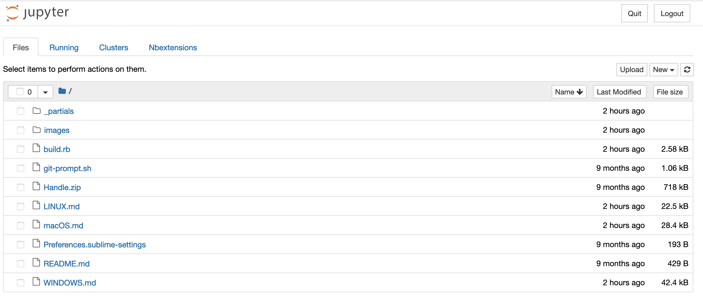

# Personal Setup Instructions

This project is for the personal setup of a new laptop for myself. This assumes an Intel Macbook Pro notebook.
It has been heavily based on the setup guide used by [Le Wagon](https://www.lewagon.com) for their bootcamps.

⚠️ Before cloning read until step 2.

To setup you will have to do the following in the follwing order.

1. Install Gitlab CLI
2. Install the dotfiles
3. Install XCode
4. Install Homebrew and its extensions
5. Install Visual Studio Code and its extensions
6. Install Oh my zsh!
7. Install Python, Jupyter and all their packages
8. Install Docker
9. Install DBeaver


## GitHub CLI

First in order to **login**, copy-paste the following command in your terminal:

⚠️ **DO NOT edit the `email`**

```bash
gh auth login -s 'user:email' -w
```

gh will ask you few questions:

`What is your preferred protocol for Git operations?` With the arrows, choose `SSH` and press `Enter`. SSH is a protocol to log in using SSH keys
instead of the well known username/password pair.

`Generate a new SSH key to add to your GitHub account?` Press `Enter` to ask gh to generate the SSH keys for you.

If you already have SSH keys, you will see instead `Upload your SSH public key to your GitHub account?` With the arrows, select your public key
file path and press `Enter`.

`Enter a passphrase for your new SSH key (Optional)`. Type something you want and that you'll remember. It's a password to protect your private
key stored on your hard drive. Then press `Enter`.

`Title for your SSH key`. You can leave it at the proposed "GitHub CLI", press `Enter`.

You will then get the following output:

```bash
! First copy your one-time code: 0EF9-D015
- Press Enter to open github.com in your browser...
```

Select and copy the code (`0EF9-D015` in the example), then press `Enter`.

Your browser will open and ask you to authorize GitHub CLI to use your GitHub account. Accept and wait a bit.

Come back to the terminal, press `Enter` again, and that's it.

To check that you are properly connected, type:

```bash
gh auth status
```

✔️ If you get `Logged in to github.com as <YOUR USERNAME> `, then all good :+1:

## Download GIT Repo

Open your terminal and run the following command:

```bash
export GITHUB_USERNAME=`gh api user | jq -r '.login'`
echo $GITHUB_USERNAME
```

You should see your GitHub username printed. Time to fork the repo and clone it on your new laptop:

```bash
mkdir -p ~/code/$GITHUB_USERNAME && cd $_
gh repo fork pepearayao/dotfiles --clone
```

We will install all of this in a later stage.

## Command Line Tools

Open a new terminal, copy-paste the following command and hit `Enter`:

```bash
xcode-select --install
```

If you receive the following message, you can just skip this step and go to next step.

```bash
# command line tools are already installed, use "Software Update" to install updates
```

Otherwise, it will open a window asking you if you want to install some software: click on "Install" and wait.

 ✔️ If you see the message "The software was installed" then all good :+1:

❌ If the command `xcode-select --install` fails try again: sometimes the Apple servers are overloaded.

❌ If you see the message "Xcode is not currently available from the Software Update server", you need to update the software update catalog:

```bash
sudo softwareupdate --clear-catalog
```

Once this is done, you can try to install again.

## Homebrew
### 1. Install:
On Mac, you need to install [Homebrew](http://brew.sh/) which is a Package Manager.
It will be used as soon as we need to install some software.
To do so, open your Terminal and run:

```bash
/bin/bash -c "$(curl -fsSL https://raw.githubusercontent.com/Homebrew/install/HEAD/install.sh)"
```

This will ask for your confirmation (hit `Enter`) and your **macOS user account password** (the one you use to [log in](https://support.apple.com/en-gb/HT202860) when you reboot your Macbook).

<details>
  <summary>🛠 If you get a <code>Error: Not a valid ref: refs/remotes/origin/master</code> error</summary>


The full error would be:

``` bash
Error: Not a valid ref: refs/remotes/origin/master :
fatal: ambiguous argument 'refs/remotes/origin/master': unknown revision or path not in the working tree.
```

Run the following commands to solve it:

``` bash
rm -fr $(brew --repo homebrew/core)  # because you can't `brew untap homebrew/core`
brew tap homebrew/core
```

</details>

If you already have Homebrew, it will tell you so, that's fine, go on.

### 2. Make sure you are on the latest version:

```bash
brew update
```

<details>
  <summary>🛠 If you get a <code>/usr/local must be writable</code> error</summary>

Just run this:

``` bash
sudo chown -R $USER:admin /usr/local
brew update
```

</details>

### 3. Then install some useful software:

Proceed running the following in the terminal (you can copy / paste all the lines at once).

```bash
brew upgrade git         || brew install git
brew upgrade gh          || brew install gh
brew upgrade wget        || brew install wget
brew upgrade imagemagick || brew install imagemagick
brew upgrade jq          || brew install jq
brew upgrade openssl     || brew install openssl
brew upgrade tree        || brew install tree
brew upgrade ncdu        || brew install ncdu
brew upgrade xz          || brew install xz
brew upgrade readline    || brew install readline
```

## Visual Studio Code

### Installation

Let's install [Visual Studio Code](https://code.visualstudio.com) text editor.

Copy (`Cmd` + `C`) the command below then paste it in your terminal (`Cmd` + `V`):

```bash
brew install --cask visual-studio-code
```

Then launch VS Code by running the following command in your terminal:

```bash
code
```

:heavy_check_mark: If a VS Code window has just opened, you're good to go :+1:

## VS Code Extensions

### Installation

Let's install some useful extensions to VS Code.

```bash
code --install-extension ms-vscode.sublime-keybindings
code --install-extension emmanuelbeziat.vscode-great-icons
code --install-extension MS-vsliveshare.vsliveshare
code --install-extension ms-python.python
code --install-extension KevinRose.vsc-python-indent
code --install-extension ms-python.vscode-pylance
code --install-extension ms-toolsai.jupyter
```
## Oh-my-zsh

Let's install the `zsh` plugin [Oh My Zsh](https://ohmyz.sh/).

In a terminal execute the following command:

```bash
sh -c "$(curl -fsSL https://raw.github.com/ohmyzsh/ohmyzsh/master/tools/install.sh)"
```

If asked "Do you want to change your default shell to zsh?", press `Y`

At the end your terminal should look like this:


## direnv

[direnv](https://direnv.net/) is a shell extension. It makes it easy to deal with per project environment variables. This will be useful in order to customize the behavior of your code.

``` bash
brew install direnv
```

## Dotfiles

Run the `dotfiles` installer.

```bash
cd ~/code/$GITHUB_USERNAME/dotfiles && zsh install.sh
```

Check the emails registered with your GitHub Account. You'll need to pick one
at the next step:

```bash
gh api user/emails | jq -r '.[].email'
```

Run the git installer:

```bash
cd ~/code/$GITHUB_USERNAME/dotfiles && zsh git_setup.sh
```

:point_up: This will **prompt** you for your name (`FirstName LastName`) and your email. Be careful
you **need** to put one of the email listed above thanks to the previous `gh api ...` command. If you
don't do that, Kitt won't be able to track your progress.

Please now **quit** all your opened terminal windows.

## Installing Python (with [`pyenv`](https://github.com/pyenv/pyenv))

### Uninstall `conda`

As we are using `pyenv` to install and manage our Python version, we need to uninstall [`conda`](https://docs.conda.io/projects/conda/en/latest/), another package manager you may have on your machine if you previously installed [Anaconda](https://www.anaconda.com/). Thus, we are preventing any possible Python version issue later.

Check if you have `conda` installed on your machine:

```bash
conda list
```
If you have `zsh: command not found: conda`, you can **skip** the uninstall of `conda` and jump to the **Install pre-requisites** section.

<details>
    <summary markdown='span'><code>conda</code> uninstall instructions</summary>

- Install the Anaconda-Clean package from your terminal and run the cleaning
```bash
conda install anaconda-clean
anaconda-clean --yes
```
- Remove every Anaconda directories
```bash
rm -rf ~/anaconda2
rm -rf ~/anaconda3
rm -rf ~/.anaconda_backup
rm -rf ~/opt
```
- Remove Anaconda path from your `.bash_profile`
    - Open the file with `code ~/.bash_profile`
    - If the file opens find the line matching the following pattern `export PATH="/path/to/anaconda3/bin:$PATH"` and delete the line
    - Save the file with `CMD` + `s`
- Restart your terminal with `exec zsh`
- Remove Anaconda initialization from your `.zshrc`:
    - Open the file with `code ~/.zshrc`
    - Remove the code lines starting from `>>> conda initialize >>>` to `<<< conda initialize <<<`
</details>


### Install pre-requisites

Before installing Python, please check your `xz` version with:

```bash
brew info xz
```

It should be more than `5.2.0`, **if not** you should run:

```bash
sudo rm -rf /usr/local/opt/xz
brew upgrade
brew install xz
```

Then run:

```bash
brew install readline
```

### Install `pyenv`

macOS comes with an outdated version of Python that we don't want to use. You might already have installed Anaconda or something else to tinker with Python and Data Science packages. All of this does not really matter as we are going to do a professional setup of Python where you'll be able to switch which version you want to use whenever you type `python` in the terminal.

First let's install `pyenv` with the following Terminal command:

```bash
brew install pyenv
exec zsh
```

### Install Python

Let's install the [latest stable version of Python](https://www.python.org/doc/versions/):

```bash
pyenv install 3.10.6
```

<details>
  <summary>🛠 Troubleshooting</summary>

If you encounter an error installing Python with `pyenv` about `zlib`:

```txt
zipimport.ZipImportError: can't decompress data; zlib not available
```

Install `zlib` with:

```bash
brew install zlib
export LDFLAGS="-L/usr/local/opt/zlib/lib"
export CPPFLAGS="-I/usr/local/opt/zlib/include"
```

Then try to install Python again:

```bash
pyenv install 3.10.6
```

It could raise another error about `bzip2`, you can ignore it and continue to the next step.

</details>
<br>

OK once this command is complete, we are going to tell the system to use this version of Python **by default**. This is done with:

```bash
pyenv global 3.10.6
exec zsh
```

To check if this worked, run `python --version`. If you see `3.10.6`, perfect! If not, ask a TA that will help you debug the problem thanks to `pyenv versions` and `type -a python` (`python` should be using the `.pyenv/shims` version first).


## Python Virtual Environment

Before we start installing relevant Python packages, we will isolate the setup of the machine into a **dedicated** virtual environment. We will use a `pyenv` plugin called [`pyenv-virtualenv`](https://github.com/pyenv/pyenv-virtualenv).

First let's install this plugin:

```bash
git clone https://github.com/pyenv/pyenv-virtualenv.git $(pyenv root)/plugins/pyenv-virtualenv
exec zsh
```

Let's create the virtual environment we are going to use during the whole bootcamp:

```bash
pyenv virtualenv 3.10.6 default
```

Let's now set the virtual environment with:

```bash
pyenv global default
```

Great! Anytime we'll install Python package, we'll do it in that environment.


## Python packages

Now it's time to install some packages in it.

First, let's upgrade `pip`, the tool to install Python Packages from [pypi.org](https://pypi.org). In the latest terminal where the virtualenv `default` is activated, run:

```bash
pip install --upgrade pip
```

Then within the same folder, let's install some packages:

``` bash
pip install -r requirements.txt
```

## `jupyter` notebook extensions

Improve `jupyter` notebooks with extensions:

```bash
# install nbextensions
jupyter contrib nbextension install --user
jupyter nbextension enable toc2/main
jupyter nbextension enable collapsible_headings/main
jupyter nbextension enable spellchecker/main
jupyter nbextension enable code_prettify/code_prettify
```

### Custom CSS

Improve the display of the [`details` disclosure elements](https://developer.mozilla.org/en-US/docs/Web/HTML/Element/details) in the notebooks.

Open `custom/custom.css` in the config directory:
```bash
cd $(jupyter --config-dir)
mkdir -p custom
touch custom/custom.css
code custom/custom.css
```
Edit `custom.css` with:

```css
summary {
    cursor: pointer;
    display:list-item;
}
summary::marker {
    font-size: 1em;
}
```

### `jupyter` check up

Let's reset your terminal:

```bash
exec zsh
```

Now, check you can launch a notebook server on your machine:

```bash
jupyter notebook
```

Your web browser should open on a `jupyter` window:



Click on `New`:


A tab should open on a new notebook:


### `nbextensions` check up

Perform a sanity check for `jupyter notebooks nbextensions`. Click on `Nbextensions`:


Untick _"disable configuration for nbextensions without explicit compatibility"_ then check that _at least_ all `nbextensions` circled in red are enabled:


You can close your web browser then terminate the jupyter server with `CTRL` + `C`.


### Python setup check up

Check your Python version with the following commands:
```bash
zsh -c "$(curl -fsSL https://raw.githubusercontent.com/lewagon/data-setup/master/checks/python_checker.sh)" 3.10.6
```

Run the following command to check if you successfully installed the required packages:
```bash
zsh -c "$(curl -fsSL https://raw.githubusercontent.com/lewagon/data-setup/master/checks/pip_check.sh)"
```

Now run the following command to check if you can load these packages:
```bash
python -c "$(curl -fsSL https://raw.githubusercontent.com/lewagon/data-setup/master/checks/pip_check.py)"
```

Make sure you can run Jupyter:

```bash
jupyter notebook
```

And open a `Python 3` notebook.

Make sure that you are running the correct python version in the notebook. Open a cell and run :
``` python
import sys; sys.version
```

Here you have it! A complete python virtual env with all the third-party packages you'll need for the whole bootcamp.


## DBeaver

Download and install [DBeaver](https://dbeaver.io/), a free and open source powerful tool to connect to any database, explore the schema and even **run SQL queries**.


## Docker 🐋

Docker is an open platform for developing, shipping, and running applications.

_if you already have Docker installed on your machine please update with the latest version_

### Install Docker

Go to [Docker](https://docs.docker.com/get-docker/) website and choose Apple Intel:


Then follow the setup instructions, you are going to install a desktop application.
